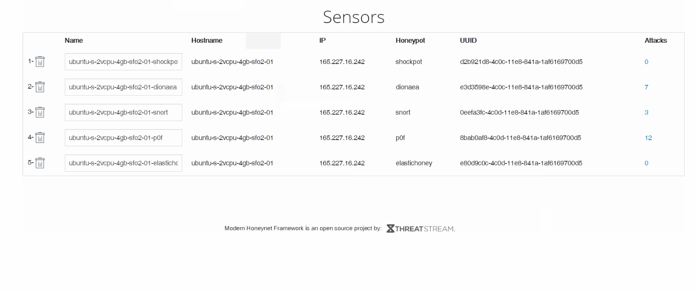
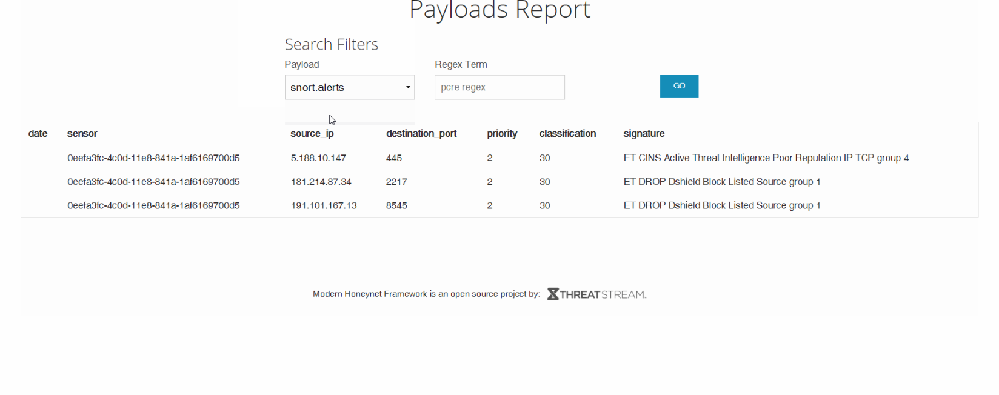

# Project-10-11----Honeypot

- [ ] Which Honeypot(s) you deployed

- [ ] A summary of the data collected: number of attacks, number of malware samples, etc.

**Attacker IPS:** 
- 118.89.239.33 
- 123.207.146.91
- 46.166.142.231 
- 50.232.230.82 
- 175.101.84.42 

**Attacked Ports:**
- 80 
- 445 
- 5060
- 8080 
- 3306 

- [ ] Any issues you encountered
  - Setting up honeypots in GCP took the longest time

- [ ] Any unresolved questions raised by the data collected
  - None as of right now.
